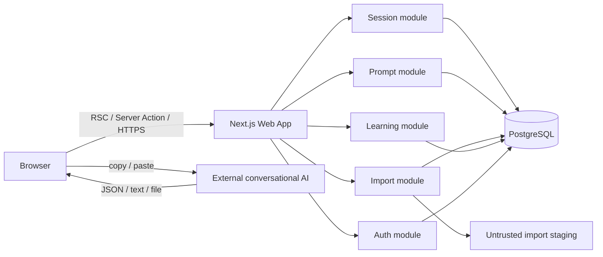
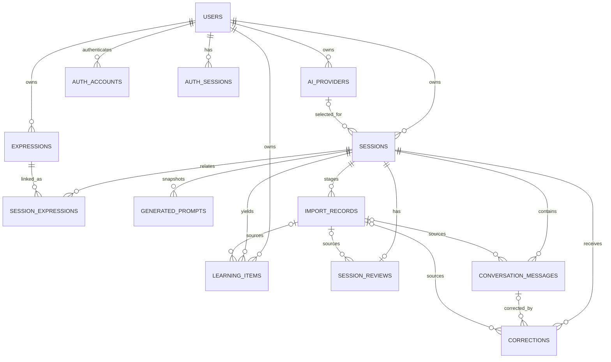
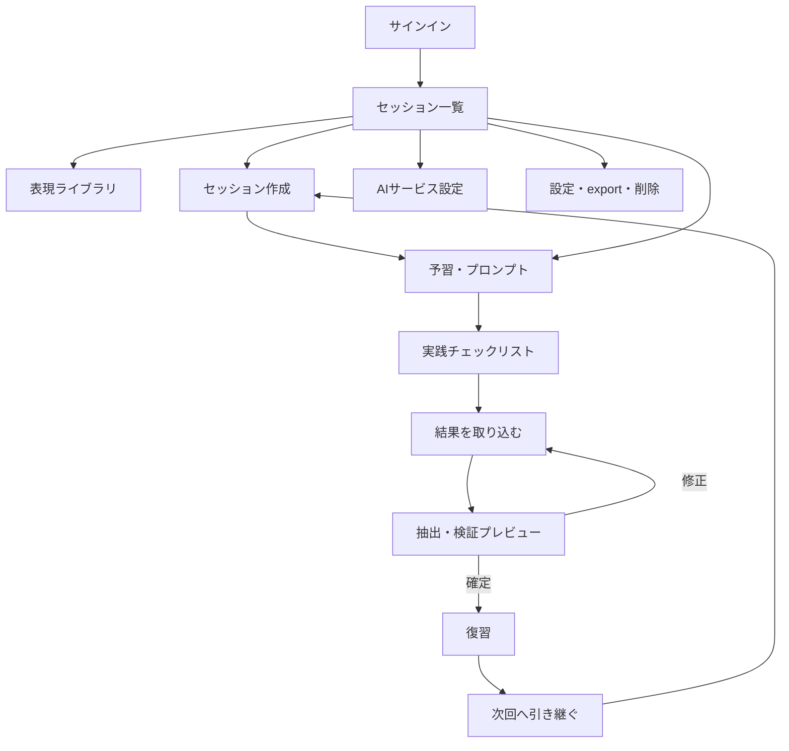

# Talk Craft プロダクト・技術設計

Status: Accepted for MVP / Updated 2026-07-15

この文書は、実装前に確定させる設計判断と、MVPを実装可能な単位へ分解した計画をまとめる。中心となる原則は「学習記録はTalk Craftに属し、外部AIサービスは交換可能な実践チャネルである」こととする。

## 1. 要件の不明点・矛盾・技術的リスク

### 決定が必要だった点と今回の判断

| 論点 | 判断 |
| --- | --- |
| 個人利用と認証の関係 | ローカルの最初の縦切りは固定の開発ユーザー、公開MVPまでに認証を必須化する。全クエリは最初から `user_id` でスコープする。 |
| 「使用予定AIは任意」と外部URL | プロバイダー参照は nullable とし、セッションに表示名・URLのスナップショットを保持する。プロバイダー削除後も履歴を再現できる。 |
| `used: false` が「未使用」か「不明」か | インポート境界では `true / false / null` を許可し、正規化後は `used / not_used / unknown` として扱う。 |
| `is_exact_transcript: false` の意味 | `exact / paraphrased / inferred / unknown` の精度区分を正規形とし、旧 boolean は互換入力として受ける。 |
| 「AI生成」と「ユーザー修正」の区別 | 各取込由来レコードに `origin_type`、`source_import_id`、`user_edited_at` を持たせ、原文は `import_records.raw_content` に不変で保存する。 |
| 表現ライブラリの編集と過去履歴 | `session_expressions` に英語・意味のスナップショットを保存する。ライブラリの後日編集で過去プロンプトを変えない。 |
| セッション作成時の入力範囲 | 最初の画面はタイトル、テーマ、任意の目的に絞る。学習表現は独立した `expressions` として保存し、`session_expressions` で任意に関連付ける。開始プロンプトには表現を含めない。 |
| プロンプト更新と再現性 | バージョン付きテンプレートをコードから読み、生成結果と入力スナップショットを `generated_prompts` に保存する。 |
| 再インポート時の重複 | MVPでは1セッションにつき確定済みAIインポートを1つとする。再取込はプレビュー後に「AI由来データを置換」し、手動作成データは保持する。 |
| 削除方式 | セッションは確認付きの物理削除。ユーザー削除は関連学習データを cascade する。監査・復元が必要になった段階で猶予付き削除を追加する。 |

### 技術的リスク

1. 外部AIが会話を参照できない、または創作するリスクは技術だけでは除去できない。完全性、推定の有無、ユーザー確認状態を表示し、「正確な逐語録」と断定しない。
2. AI出力JSONは構文が正しくても意味的に誤り得る。保存前プレビューとユーザー確認を必須にし、直接ドメインテーブルへ書き込まない。
3. JSON抽出は説明文中の例や複数オブジェクトを誤選択し得る。候補を列挙し、曖昧なら自動確定しない。
4. 巨大入力、深いネスト、長大文字列はメモリ・DB・画面を圧迫する。貼付け／ファイルともUTF-8で2 MiB、深さ20、会話1000件、各文字列の上限を設ける。
5. JSONの重複キーは通常の `JSON.parse` では検知できない。字句解析段階で警告し、確定前にユーザーへ示す。
6. 音声会話の「聞き取れなかった箇所」はAIだけでは判断不能なことが多い。AI提案とユーザー自身の記録を別の出所として扱う。
7. 外部URLは open redirect、javascript URL、フィッシング表示の入口になる。保存時に `https:` を基本として検証し、遷移時は外部サイトであることを示す。
8. 会話ログには個人情報・機密情報が入り得る。ログ本文をアプリケーションログや分析基盤へ送らず、削除・エクスポート導線を用意する。
9. 現在の `drizzle-kit` 安定版は、開発用の推移依存に古いesbuildを含み `npm audit` のmoderate警告対象になる。本番依存のauditは0件。開発サーバー／Drizzle Studioを外部公開せず、安定版の修正を追跡する。

## 2. MVPに必要な機能の再整理

MVPは次の5つの利用可能な縦切りに分ける。

1. 準備: タイトル・テーマ・任意の目的によるセッション作成、独立した表現ライブラリとセッション関連付け、開始／終了プロンプト生成とコピー。
2. 実践の記録: 開始・終了時刻、外部会話URL、利用モデル、会話方式の保存。
3. 安全な取込: JSON貼付け／ファイル、原文保存、抽出、検証、プレビュー、修正、確定。
4. 復習: 要約、会話、修正、聞き取り、言えなかった内容、自己メモの閲覧・編集。
5. 継続: 次回表現をライブラリへ登録し、新規セッションへ引き継ぐ。過去セッションと表現を一覧できる。

公開MVPまでに認証、所有者認可、データ削除・JSONエクスポートを追加する。YouTube教材以外の外部API連携、リアルタイム音声、ブラウザ拡張は対象外とする。

## 3. 推奨技術スタック

| 領域 | 採用 | 理由 |
| --- | --- | --- |
| Web | Next.js 16 App Router / React 19 / TypeScript | UI、Server Components、フォーム処理、Route Handlerを単一デプロイ単位にまとめられる。 |
| UI | セマンティックHTML + 通常のCSS（CSS custom properties） | 初期依存を減らし、スマートフォン対応とアクセシビリティを制御しやすい。デザインシステム導入は必要になってから行う。 |
| DB | PostgreSQL 18（本番はマネージドPostgreSQL） | JSONB、配列、制約、全文検索への拡張余地があり、特定ホスティングに依存しない。 |
| ORM / migration | Drizzle ORM 0.45 + Drizzle Kit | SQLに近い型安全な定義で、DB制約を隠さない。現行Node 20環境でも利用できる。 |
| 入力検証 | Zod 4 + JSON Schema Draft 2020-12 | フォームと外部AI出力を同じ境界方針で検証し、公開スキーマも配布できる。 |
| 認証 | Better Auth 1.6 + Drizzle adapter | Next.js 16とDrizzleの公式統合があり、認証を自作せずDBを自己管理できる。最初の縦切り後に導入する。 |
| テスト | Vitest、Testing Library、Playwright | ドメイン単体、コンポーネント、主要ユーザーフローを層別に検証する。 |
| ローカル | Node.js 20.9+、npm、Docker Compose | 追加のクラウド契約なしに同じPostgreSQLで開発できる。 |
| CI | GitHub Actions | `lint`、`typecheck`、`test`、`build`、migration検査をPR単位で行う。 |

## 4. システム構成

初期は1つのNext.jsアプリと1つのPostgreSQLからなるモジュラーモノリスとする。



モジュール間はapplication serviceを介す。UIからORMを直接呼ばない。将来のAPI・拡張機能・音声処理も同じapplication serviceを利用する。重い文字起こし等が必要になるまではジョブ基盤を導入しない。

## 5. ディレクトリ構成

```text
src/
  app/                         # ルーティングと画面。薄く保つ
    api/                       # 外部境界が必要なRoute Handlers
    sessions/
    expressions/
  components/                  # 複数画面で共有するUI
  modules/
    sessions/
      application/             # ユースケース、認可、トランザクション境界
      domain/                  # 型、状態遷移、Zod入力
      infrastructure/          # Drizzle repository
      ui/                      # セッション固有UI
    prompts/
      application/
      domain/
      templates/generic/v1/    # バージョン付き汎用テンプレート
    imports/
    learning/
    providers/
    auth/
  db/
    schema/                    # テーブル定義（モジュール別）
    client.ts
  lib/                         # env、共通エラー、汎用小関数
drizzle/                       # レビュー可能なSQL migration
docs/
  api/openapi.yaml
  schemas/session-review.v1.schema.json
```

禁止する依存は `domain -> infrastructure/app` と `template -> 特定AI製品SDK`。静的な依存境界checkはモジュールが増えた段階で追加する。

## 6. データベース設計

すべてのIDはUUID、日時は `timestamptz`、自由文はUTF-8の `text` とする。列挙値はアプリだけでなくDB enum/checkでも制約する。更新競合に備え、編集対象には `version` を持たせる。

### 主要テーブル

| テーブル | 主な役割・補足 |
| --- | --- |
| `users` | 認証ユーザーと学習設定。`english_level`、言語、タイムゾーンを保持。 |
| `auth_accounts`, `auth_sessions`, `auth_verifications` | Better Authの認証用。学習セッションと命名を分ける。 |
| `ai_providers` | ユーザー定義の外部AIサービス。能力フラグは nullable（不明を表現）。 |
| `sessions` | 学習サイクルの集約ルート。作成時の中心項目はタイトル、テーマ、任意の目的。既存の条件列は後方互換のため残すが、初期画面では使用しない。 |
| `expressions` | ユーザーの再利用可能な表現ライブラリ。配列項目はJSONBで構造化する。 |
| `session_expressions` | セッションと表現の関連、使用予定・結果・引継ぎ、当時の表現snapshot。 |
| `prompt_templates` | 将来の管理画面／プロバイダー別override用。MVPの標準テンプレートはコード管理。 |
| `generated_prompts` | 種別、template key/version、入力snapshot、生成本文。履歴再現用。 |
| `import_records` | raw、抽出候補、正規化候補、検証結果、状態、SHA-256。確定前のstaging。 |
| `session_reviews` | セッション単位の要約、次回推奨、自己振り返り。 |
| `conversation_messages` | 順序付き発言。精度区分、聞取困難、出所を保持。 |
| `corrections` | 発言任意参照、原文、訂正、自然な表現、理由、カテゴリ。 |
| `learning_items` | good point / missed opportunity / listening / next expressionを共通管理。 |

### 重要な制約・索引

- すべての取得・更新で `user_id` を条件に含める。子テーブルだけを取得するときも親セッション所有者をjoin確認する。
- `sessions(user_id, scheduled_at desc)`、`expressions(user_id, updated_at desc)`、`conversation_messages(session_id, sequence)` に索引。
- `session_expressions(session_id, expression_id)`、`generated_prompts(session_id, prompt_type, revision)` はunique。
- `import_records(session_id, content_sha256)` は重複警告に使う。完全uniqueにはせず、明示的な再試行は保存可能にする。
- `conversation_messages(session_id, sequence)` はunique。
- provider削除はセッション参照を `set null`、user/session削除は所有データをcascade。
- raw importと会話本文を通常のアプリログへ出力しない。

## 7. ER図



## 8. API設計

ブラウザUIの通常フォームはServer Actionsを使うが、処理本体はHTTPに依存しないapplication serviceとする。ファイル取込、エクスポート、将来の拡張機能向けに `/api/v1` Route Handlerを用意する。詳細な契約は `docs/api/openapi.yaml` を正とする。

### 主要エンドポイント

| Method | Path | 用途 |
| --- | --- | --- |
| GET/POST | `/api/v1/sessions` | 一覧／作成 |
| GET/PATCH/DELETE | `/api/v1/sessions/{sessionId}` | 詳細／更新／削除 |
| POST | `/api/v1/sessions/{sessionId}/transitions` | 状態遷移。任意のstatus上書きを避ける |
| GET/POST | `/api/v1/expressions` | 独立した表現ライブラリの一覧／作成 |
| GET/PATCH/DELETE | `/api/v1/expressions/{expressionId}` | 表現の取得／編集／アーカイブ |
| POST/DELETE | `/api/v1/sessions/{sessionId}/expressions/{expressionId}` | セッションとの関連付け／解除 |
| GET/POST | `/api/v1/providers` | プロバイダー一覧／追加 |
| POST | `/api/v1/sessions/{sessionId}/prompts/{type}/generations` | prompt snapshot生成 |
| POST | `/api/v1/sessions/{sessionId}/imports` | pasteまたはmultipart uploadをstaging |
| PATCH | `/api/v1/imports/{importId}` | 修正原文を保存し再検証 |
| POST | `/api/v1/imports/{importId}/commit` | expected version付きで確定 |
| GET | `/api/v1/exports/me` | ユーザーデータのJSON export |

認証失敗は401、他人のリソースは存在推測を避け404、競合は409、形式は422、サイズ超過は413。エラーはRFC 9457 Problem Details形式とし、各リクエストにrequest IDを付ける。POSTの再送には `Idempotency-Key` を将来対応する。

## 9. 画面一覧と画面遷移



画面は `/sessions/[id]` 内を「準備・実践・取込・復習」のタブまたはステップとしてまとめ、画面往復を減らす。スマートフォンでは下部の主要actionをstickyにする。

## 10. 各画面の主要コンポーネント

| 画面 | 主要コンポーネント |
| --- | --- |
| ホーム | 次の予定、未復習セッション、引継ぎ表現、最近の学び |
| セッション一覧 | status filter、日付、provider snapshot、方式、検索、作成ボタン |
| 作成・編集 | タイトル、テーマ、任意の目的、1件ずつ追加する独立表現フォーム、入力エラーsummary |
| 予習 | GoalCard、TalkingPointList、LinkedExpressionList、PromptPanel、CopyButton、外部リンク警告 |
| 実践 | Theme/Goal sticky card、表現チェック、開始/終了ボタン、外部URLメモ |
| 取込 | PasteArea、FileDropzone、サイズ表示、ValidationIssueList、Raw/Parsed切替 |
| プレビュー | completeness banner、差分・警告、各項目編集、確定／破棄 |
| 復習 | Summary、Transcript、CorrectionList、MissedOpportunity、ListeningReview、自己メモ |
| 表現ライブラリ | status/priority filter、次回復習日、詳細drawer、セッションへ追加 |
| AIサービス設定 | provider form、能力は「対応/非対応/不明」、URL、注意メモ、有効状態 |
| 設定 | 言語・レベル・timezone、JSON export、アカウント削除 |

## 11. AIプロバイダーを抽象化する方法

ドメインはプロバイダーのAPIや製品名を知らない。連携方式の差を次のportで隔離する。

```ts
interface ConversationIntegrationAdapter {
  readonly key: string;
  getCapabilities(config: ProviderConfig): ProviderCapabilities;
  buildLaunchTarget(input: LaunchInput): LaunchTarget | null;
  normalizeImport(input: UnknownExternalPayload): ImportCandidate;
  validateConfig(config: ProviderConfig): ValidationIssue[];
}
```

MVPは `GenericManualAdapter` のみを持ち、copy/paste、任意URL、汎用JSONを扱う。将来のprovider API、extension、独自agent、リアルタイム音声は別adapterとしてapplication portを実装する。provider固有IDやmodel enumは汎用テーブルの必須列にせず、外部接続設定は暗号化した別テーブルに置く。

能力は単純なbooleanだけで固定せず、`supported / unsupported / unknown` と任意metadataを表現する。UIは能力情報を案内に使うだけで、誤った能力値を理由に学習記録の閲覧を拒否しない。

## 12. プロンプトテンプレートの管理方法

- 標準テンプレートは `src/modules/prompts/templates/generic/v1` に置き、コードレビュー・テスト・リリースと一緒にversion管理する。
- template key、semantic version、対応schema versionを明示する。
- rendererへ渡す入力は型付きDTOとし、UI文字列連結を禁止する。
- 生成時にtemplate key/version、入力snapshot、rendered contentを保存する。
- 会話開始用templateへはテーマと任意の目的だけを渡し、独立した学習表現は含めない。関連表現は振り返り時の使用状況確認にだけ利用できる。
- user/provider別overrideが必要になったら `prompt_templates` に追加し、標準templateをfallbackにする。
- template変更は既存snapshotを変更しない。再生成はrevisionを増やし、ユーザーがどれを利用したか記録する。
- 外部AIへのprompt injectionを完全には防げないため、ユーザー入力を区切り付きdataとして挿入し、秘密情報や内部命令をtemplateへ含めない。

## 13. 外部AI出力JSONのスキーマ定義

正本は `docs/schemas/session-review.v1.schema.json`。Draft 2020-12を使い、トップレベルに次を追加する。

- `schema_version: "1.0"`: parser選択と移行に使用。
- `source`: provider、model、conversation type、record completeness、AI推定の有無。
- `session_summary`、`conversation`、`prepared_expressions`、`good_points`、`corrections`、`missed_opportunities`、`listening_review`、`expressions_for_next_session`、`next_session`。

未知フィールドはstagingでは保持しwarning、正規化済みdomain DTOでは落とす。列挙の大文字小文字・ハイフンは既知aliasだけ正規化し、未知値を勝手に近い値へ変換しない。意味上の不明値は `unknown` または `null` とし、空文字と事実上のfalseを混同しない。

## 14. JSONインポート時のバリデーション設計

インポートは次の段階を必ず分離する。

1. 受付: MIMEを信用せずbytesを数え、2 MiB超を拒否。BOMを除去しUTF-8を検証。SHA-256を計算。
2. 保存: rawを `RECEIVED` 状態で保存する。アプリログには出さない。
3. 抽出: 単一のMarkdown fenceを除去し、文字列escapeを理解するscannerでtop-level JSON候補を抽出。複数なら選択を要求。
4. 構文検証: 深さ、token数、重複key、prototype pollution keyを確認してparse。
5. schema検証: JSON Schema/Zodでpath単位のerror/warningを作る。
6. 正規化: 既知enum alias、欠損時の安全な初期値、文字列改行だけを正規化。会話内容は補完しない。
7. 意味検証: sequence、配列上限、session topicとの不一致、`complete` と空会話等をwarning。
8. preview: raw、抽出内容、正規化候補、破棄フィールド、warningを表示。
9. commit: user確認、version一致、所有者確認後、transactionでdomain tableへ反映。

HTMLは保存時に「sanitizeして意味を変える」のではなくplain textとして保持し、Reactのescapeされたtext nodeで表示する。`dangerouslySetInnerHTML` は使用しない。CSV export時はformula injection対策も行う。

## 15. 不正なJSONを修復または手動修正するフロー

1. 貼付け直後に、機械的で意味を変えない修復（fence/BOM/前後説明の除去）だけを自動提案する。
2. 抽出候補が複数なら候補を選ばせる。
3. trailing comma、quote不足など意味が変わり得る修復は原文を上書きせず、editable copyに適用して差分を見せる。
4. form viewではpathごとの項目を編集でき、raw JSONを扱えないユーザーも直せる。
5. 「空の雛形から手動入力」を常に選択可能にする。
6. 再検証するたびrevisionを増やし、raw originalは不変にする。
7. errorが0でもwarningと完全性を確認しない限りcommitできない。
8. commit後のユーザー編集はAI原文を書き換えず、`user_edited_at` と変更後のdomain値を保存する。

自動修復に外部AIを使う機能はMVP対象外。会話データを別サービスへ再送することによるプライバシー問題を避ける。

## 16. 認証・認可の設計

公開MVPはBetter Authでemail/passwordまたはmagic linkを提供する。OAuthは必要性が確認できてから追加する。cookieはHttpOnly、Secure、SameSite=Lax、session rotationを有効にする。

認可はproxyだけに依存しない。各Server Action、Route Handler、application serviceでsessionを検証し、repositoryに `actorUserId` を必須引数として渡す。他人のUUIDを指定されても `WHERE id = ? AND user_id = ?` で取得し404を返す。UUIDは認可境界ではない。

最初のローカル縦切りは `DEV_USER_ID` を使うが、production build/runtimeでは固定ユーザーfallbackを許可しない。認証導入時にapplication serviceのsignatureは変えず、actor解決だけを差し替える。

## 17. セキュリティ上の注意点

- CSP (`default-src 'self'`) を導入し、inline scriptを避ける。フレーム埋込を拒否する。
- state変更はPOST/PATCH/DELETEだけで行い、Origin検証とSameSite cookieを併用する。
- 認証、import、export、削除にuser/IP単位のrate limitを設ける。
- ZodはUX用だけでなくserver境界で必ず実行する。DB制約も重ねる。
- URLはprotocol allowlist、ファイルは拡張子でなく内容・sizeで検証する。
- raw/parsed JSONをHTMLとしてrenderしない。Markdown対応時もsanitize済みrendererを使う。
- DB接続、mail API、将来のprovider tokenはsecret managerへ置き、token列はapplication-level encryptionする。
- DB backup、restore drill、ユーザーexport/削除を公開前に確認する。
- 本文をerror tracking、analytics、access logへ含めない。request IDと件数・状態だけを記録する。
- 依存更新、lockfile、CodeQL/Dependabot相当、定期的な脆弱性確認を行う。
- exportは再認証または短時間の確認を要求し、Content-Dispositionを安全に設定する。

## 18. MVPの実装順序

1. Foundation: Next.js、DB、migration、env検証、CI、共通error。
2. Preparation vertical slice: 最小項目のsession CRUD、独立した表現CRUDと関連付け、prompt生成・copy。
3. Authentication: Better Auth、所有者スコープ、sign-in/up、既存devデータ移行。
4. Practice tracking: status transition、開始/終了、外部URL、使用表現check。
5. Import staging: paste/file、raw保存、size/JSON/schema検証、preview。
6. Import commit/review: transaction反映、復習表示、provenance、ユーザー編集。
7. Carry-over/library: 次回表現、filter、次セッション作成。
8. Privacy finish: export、delete、rate limit、CSP、backup/restore確認。
9. Release hardening: E2E、accessibility、mobile、observability、運用手順。

## 19. 実装タスクの分割

各タスクは原則1PRで完結させる。

### Foundation

- F-01 app scaffold、lint/typecheck/test/build scripts。
- F-02 PostgreSQL Compose、Drizzle client/schema/migration/seed。
- F-03 environment schema、Problem Details、request ID、logging redaction。
- F-04 CIとmigration drift check。

### Preparation

- P-01 session input/domain/state enum。
- P-02 session repositoryとcreate/list/detail。
- P-03 独立したexpression CRUD、session関連付け、snapshot。
- P-04 generic prompt v1、snapshot、単体test。
- P-05 responsive create/list/detail UIとcopy。
- P-06 edit/deleteと競合制御。

### Auth / providers

- A-01 Better Auth schema/config/API route。
- A-02 sign-in/up、server-side session validation。
- A-03 全repositoryのownership test。
- A-04 AI provider CRUD、自由入力とsnapshot。

### Import / review

- I-01 v1 Zod/JSON Schema contract test。
- I-02 raw受付、size/UTF-8/hash。
- I-03 fence/JSON候補scanner、duplicate/depth検査。
- I-04 schema/semantic validationとnormalizer。
- I-05 preview/editor UI。
- I-06 transactional commitとreplace policy。
- R-01 review read modelと画面。
- R-02 user edit/provenance表示。
- R-03 carry-over/library。

### Release

- S-01 CSP、rate limit、URL/file hardening。
- S-02 JSON export、account/session delete。
- S-03 Playwright happy/error flows、axe accessibility。
- S-04 deployment、backup、restore、privacy文面。

## 20. テスト方針

テスト比率はrisk基準とする。

- Unit: prompt renderer、状態遷移、normalizer、JSON candidate scanner、enum alias、size/depth limit。
- Schema contract: 正常fixture、各欠損・型違い・未知enum・巨大配列・重複key。JSON SchemaとZodの受理差を検知する。
- Repository integration: 実PostgreSQLでcascade、unique、transaction rollback、user isolation、再import置換。
- Component: form error focus、copy fallback、warning、provenance表示。
- E2E: session作成→prompt copy、import error→修正→commit→review→carry-over、他ユーザーアクセス拒否、mobile viewport。
- Security: XSS payload、javascript URL、prototype pollution key、CSV formula、oversize/deep JSON、CSRF、IDOR。
- Accessibility: keyboardのみ、focus、label、error summary、色以外の状態表現、主要画面のaxe。

CIの必須gateは `lint`、`typecheck`、unit/integration、production build。E2Eは公開MVP前に必須化する。

## 21. ローカル開発環境の構築手順

前提はNode.js 20.9以上、npm 11、Docker + Compose。

```bash
cp .env.example .env
npm install
docker compose up -d db
npm run db:migrate
npm run db:seed
npm run dev
```

別terminalで次を実行できる。

```bash
npm run lint
npm run typecheck
npm test
npm run build
```

DBを作り直す場合は、ローカルデータが消えることを確認してから `docker compose down -v`、`docker compose up -d db`、migration、seedの順に実行する。migrationは `npm run db:generate` で生成し、SQLをreviewしてからcommitする。本番で `db:push` は使わない。

## 22. YouTube字幕教材（2026-07-15追加）

### 利用フロー

1. `/youtube/new` でYouTube URLを受け取り、動画IDを許可したYouTube URL形式からのみ抽出する。
2. サーバー側で公開動画情報と英語字幕を取得する。投稿者作成の英語字幕を優先し、存在しない場合のみ自動生成字幕を選ぶ。字幕キューは翻訳依頼用の番号付きソース単位へまとめるが、この番号を画面の段落境界には使用しない。
3. サーバー側のResponses APIから `gpt-5.6-luna` を呼び出す。第1段階は字幕全体をreasoning autoで解析し、短い要約、自然な段落の終了字幕ID、必要最小限の統一用語だけをStructured Outputsで取得する。段落の文数・行数・文字数は指定しない。Talk Craft上の `auto` はAPIへreasoning effortを送らず、モデル既定に任せることを意味する。
4. 第2段階もreasoning autoとし、第1段階で確定した意味段落ごとに前後文脈を添え、最大3並列のバッチ処理で日本語訳と動画全体で最大12件の重要表現を生成する。
5. 出力コストを抑えるため、AIは英語原文、段落開始ID、時刻を返さない。Talk Craftが段落終了IDから原文・開始ID・時刻を決定論的に復元する。翻訳段落の欠落・重複・順序、表現数、表現の参照段落、引用の原文一致を検証し、不正な表現は保存しない。意味検証に失敗したチャンクだけ1回再試行する。段落構造の確定時と各翻訳チャンクの完了時にチェックポイントをDBへ保存し、中断後の再実行では検証済みチャンクを再利用する。旧手動JSON形式は保存済みデータとの互換用パーサーとして残す。
6. 詳細画面ではAIが構成した段落単位で英語原文と日本語訳を同じ行に表示する。重要表現は通常文と同じ折り返し規則を持つ赤色・下線付きのインライン注釈とし、クリック時に右側のコメントパネルで意味・ニュアンス・例文を参照できるようにする。狭い画面では同じ情報を画面下部のパネルに表示する。
7. ユーザーは英語原文内をドラッグ選択し、任意の文字列を重要表現として追加できる。追加時は原文との一致、重複、所有者、更新versionを検証し、AI翻訳を登録し直してもユーザー追加表現を保持する。
8. 詳細画面では `youtube-nocookie.com` の埋め込みプレーヤーを表示し、ページを離れずに動画を再生できるようにする。投稿者が埋め込みを禁止した動画にはYouTube本体へのリンクを代替導線として残す。
9. 所有するYouTube教材は確認ダイアログを経て削除できる。削除対象は `user_id` でスコープし、教材行に含まれる字幕・翻訳・重要表現・AI原文を一括削除した後、教材一覧へ戻す。

### 保存モデル

`youtube_materials` はユーザーとYouTube動画IDの組をuniqueとし、動画メタデータ、字幕原文、番号付きソースブロック、互換用プロンプトとversion、日本語要約、アプリが復元した英語段落とAIの日本語訳、AI／ユーザー由来の重要表現、監査用のコンパクトなAI出力を保持する。生成途中の `generation_status`、検証済み構造・チャンクを持つ `generation_checkpoint`、再試行時に表示する `generation_error` も保存する。更新競合用の `version` と翻訳完了を示す `translated_at` を持ち、ユーザー削除時はcascadeする。

### 外部仕様と制約

YouTube Data APIの `captions.download` は動画を編集できるユーザーの認可を必要とするため、任意の公開動画を対象にする本機能では利用できない。公開ページと非公式の字幕取得インターフェースを利用するため、YouTube側の変更、レート制限、Bot判定により取得できなくなる可能性がある。取得失敗は空字幕として保存せず、ユーザーに再試行可能なエラーとして返す。動画IDから組み立てたURLとYouTubeドメインの字幕URL以外へアクセスせず、SSRFを避ける。

OpenAI APIキーはサーバー側の `OPENAI_API_KEY` だけから読み取り、クライアントバンドル、HTML、ログ、DBへ保存しない。字幕本文とモデル出力もアプリケーションログへ書き込まない。

## 実装開始前の明示事項

### 採用する技術と採用理由

Next.js/TypeScriptのモジュラーモノリス、PostgreSQL、Drizzle、Zodを採用する。1言語・1repository・1deployableで小人数の変更速度を保ちつつ、DB制約、application service、adapter portで将来の連携方式を分離できるためである。

### 採用しなかった主な選択肢

- マイクロサービス: 現時点の負荷・チーム規模ではdeploy、監視、整合性管理のコストが先行する。
- Firebase/Firestore中心: session-reviewの関連データ、transaction、export、検索ではPostgreSQLの方が自然。
- Prisma 7: 良い選択肢だが、現行ローカルNode 20.18が要求する20.19を満たさない。無理なruntime更新を初手の前提にしない。
- NextAuth/Auth.js v5: npm上でbetaのため、新規実装はstableなBetter Authを選ぶ。
- Tailwind/UI component kit: MVP開始時点では通常CSSで十分。必要性が見えた段階で導入できる。
- tRPC/GraphQL: UIとserverが同一codebaseで、外部連携にはREST/OpenAPIが理解されやすい。
- 外部AIによる壊れたJSONの自動修復: 会話データの再送と意味の捏造リスクがある。

### MVPで割り切る部分

- 手動copy/pasteを唯一の共通連携方式とする。
- 公開前の最初の縦切りだけ固定dev userを使う。
- 汎用template v1のみで、provider別最適化UIは作らない。
- JSON/JSON fileを優先し、Markdown/plain textは手動入力への導線を提供する。
- transcriptの真偽を自動判定せず、完全性と推定表示、ユーザー確認で扱う。
- 全文検索、間隔反復、音声、通知、チーム機能は含めない。

### 将来変更が難しくなる部分

最も変更コストが高いのは、公開後のJSON schema、DBの所有権境界、session status、削除方針、prompt snapshotの欠落である。そのため、schema version、全行のowner追跡、明示的状態遷移、raw import、snapshotを初期から入れる。UI見た目、hosting、CSS手法、特定provider adapterは比較的交換しやすい。

### AIプロバイダー非依存性の担保

ドメイン語彙を `Session`、`AIProvider`、`ConversationMessage`、`ImportRecord` に限定し、製品名・SDK型・外部conversation IDを中心モデルへ持ち込まない。手動/API/extension/voiceの違いはadapter port、prompt差はversioned template、出力差はstaging normalizerで吸収する。学習記録とraw importはTalk Craft側に保存する。

### 最初に作成するファイルと役割

1. `package.json`, `tsconfig.json`: 実行・品質checkの基盤。
2. `compose.yaml`, `.env.example`: 再現可能なPostgreSQL環境。
3. `src/db/schema/*`, `drizzle/*`: 最初の永続化契約。
4. `src/modules/sessions/domain/*`: UI/DBから独立したsession入力規則。
5. `src/modules/prompts/templates/generic/v1/*`: 汎用promptとversion境界。
6. `src/modules/sessions/application/*`: create/list/detail use case。
7. `src/app/sessions/*`: 最小の操作可能な画面。
8. `src/**/*.test.ts`: promptとvalidationの回帰防止。

## 参照した公式資料

- Next.js installation: https://nextjs.org/docs/app/getting-started/installation
- Drizzle ORM overview: https://orm.drizzle.team/docs/overview
- Zod: https://zod.dev/
- Better Auth introduction / Next.js / Drizzle: https://better-auth.com/docs/introduction, https://better-auth.com/docs/integrations/next, https://better-auth.com/docs/adapters/drizzle
- YouTube Captions list / download: https://developers.google.com/youtube/v3/docs/captions/list, https://developers.google.com/youtube/v3/docs/captions/download
